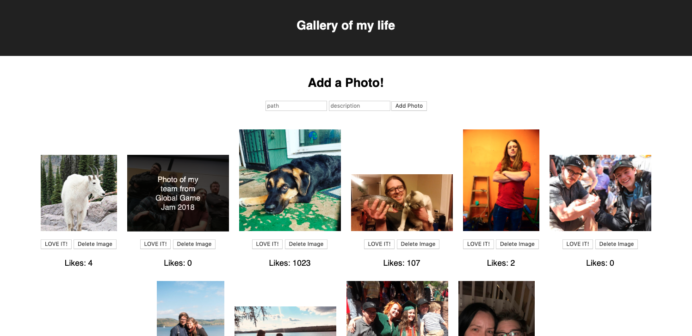

# React Gallery

This is a full stack react gallery. It pulls image paths from a database and renders them on the DOM on page load. The user can like or delete an image. The pictures likes are stored on the database and the delete button deletes images from the database. The user can add a new image via a form. Finally the images have descriptions that can be revealed via clicking on each image.

## Built With
This project uses html/css, and React for the front-end and node.js, and express.js as a server and finally postgresql for a database.

## Getting Started
To get this project running you'll have to:
* fork and clone this repo. 
* create a postgresql database using the queries in the 'Database.sql' file (table and inserts only).
star:
- You'll want to run a postrgesql server while using this project
* in the directory you cloned this repo to, you'll need to run `npm install` to get the dependencies installed for this project.
* once you have your database created and running and you've installed all dependencies, you'll have to run your express server. You should be able to do so by running `npm run server`.
* Once your server is running, you can run the project in a browser by running `npm run client`

## Prerequisites
In order to run this project you'll need to install:

* [node.js](https://nodejs.org/en/) 
* [express.js](https://expressjs.com/) 
* [react](https://reactjs.org/) 
* [postgres](https://www.postgresql.org/) and 
* [pg](https://node-postgres.com/)
* All of these can also be installed using NPM (this is my preferred method)
* [NPM](https://www.npmjs.com/)

## Installing
* Download this project.
* install prerequisite libraries listed above.
* create a database called `react-gallery` and run all queries in the `Database.sql` file.
* run `npm install` from project directory in terminal
* run `npm run server` to start your express server
* run `npm run client` to open this project up in a browser

## Screen Shot

## Completed Features
* Developed react components that display on the DOM
* Images are pulled from the database and Displayed via react components
* Images on click reveal a description overlay on the image.
* All images have a `LOVE IT!` button and a `Delete Image` button. loving an images increments its likes, deleting an image deletes it from the database
* functionality to add an image path to the database.

## Author
[Stefen Menzel](https://github.com/stefenmenzel)

